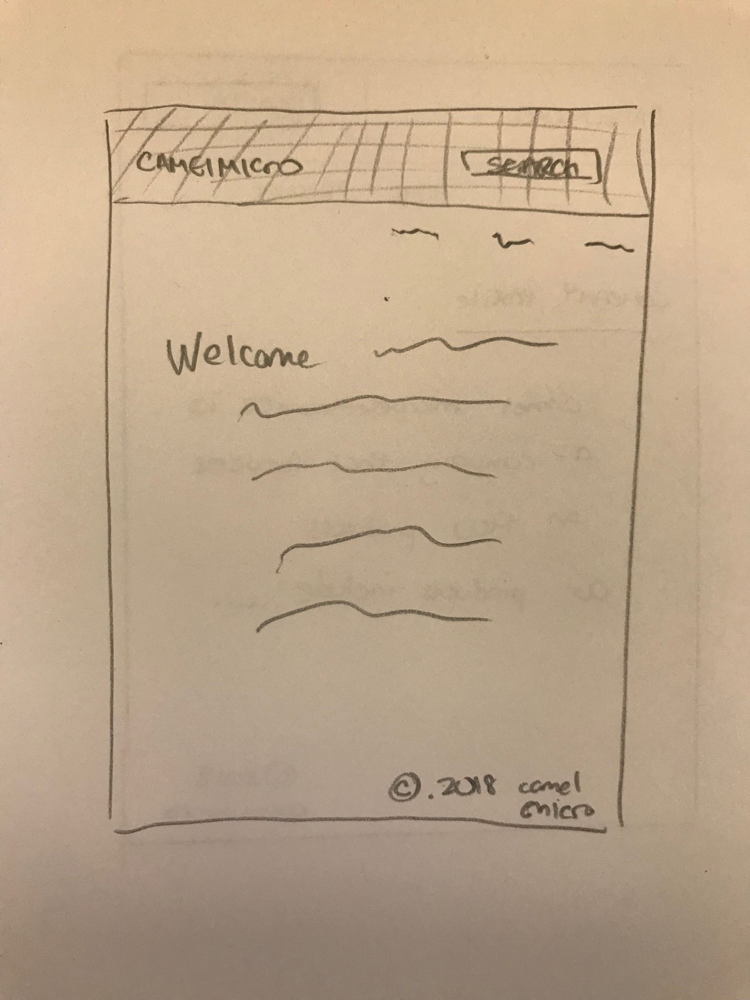
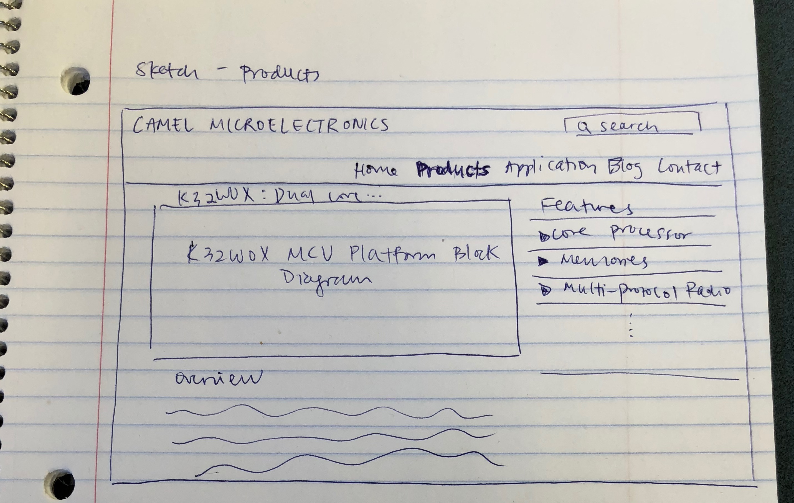
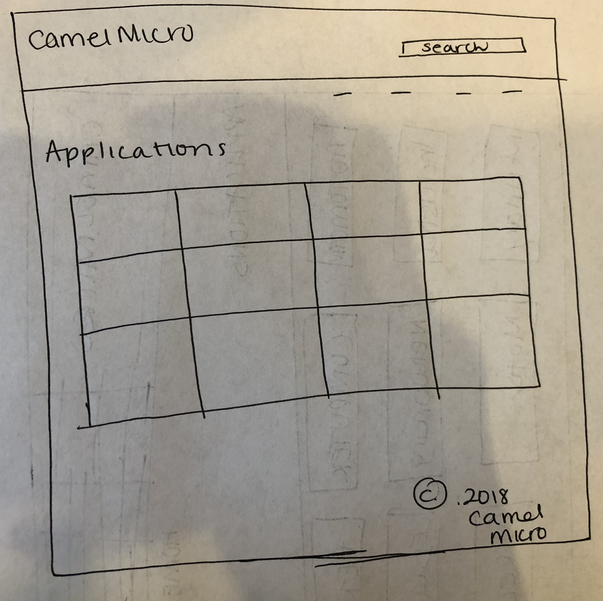
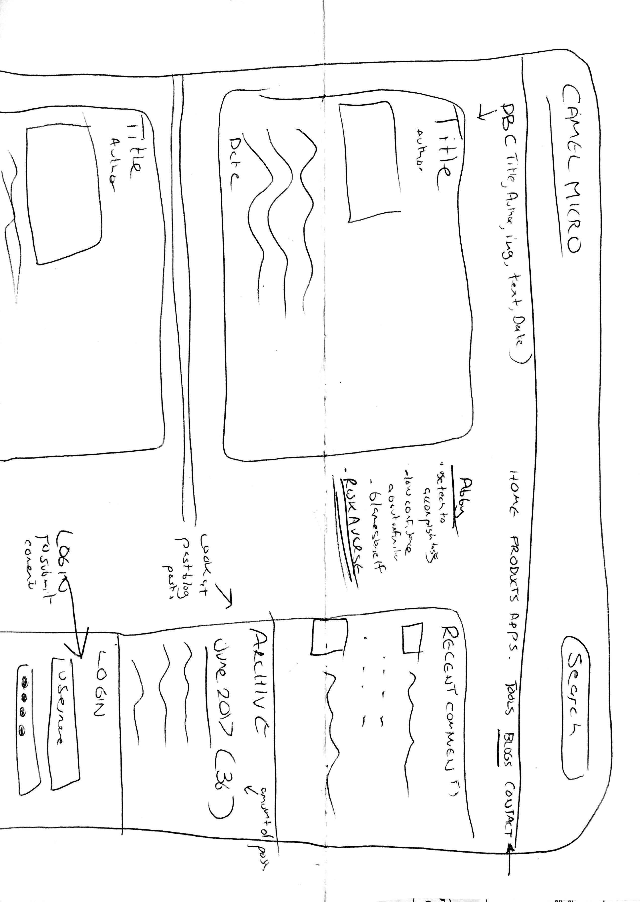
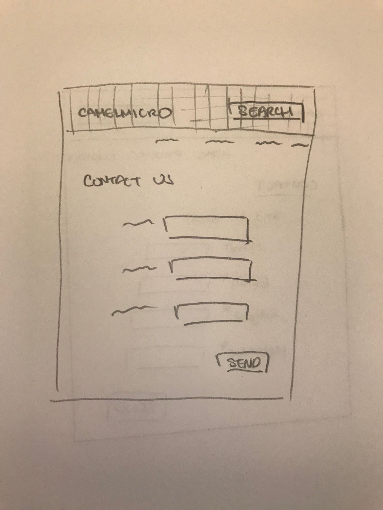
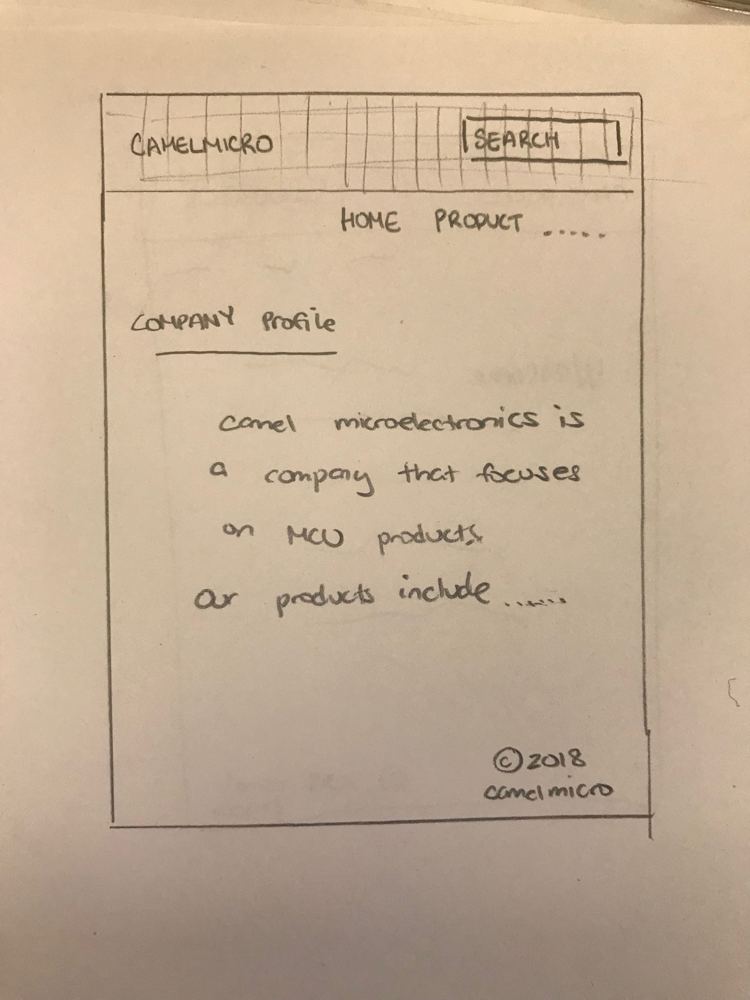
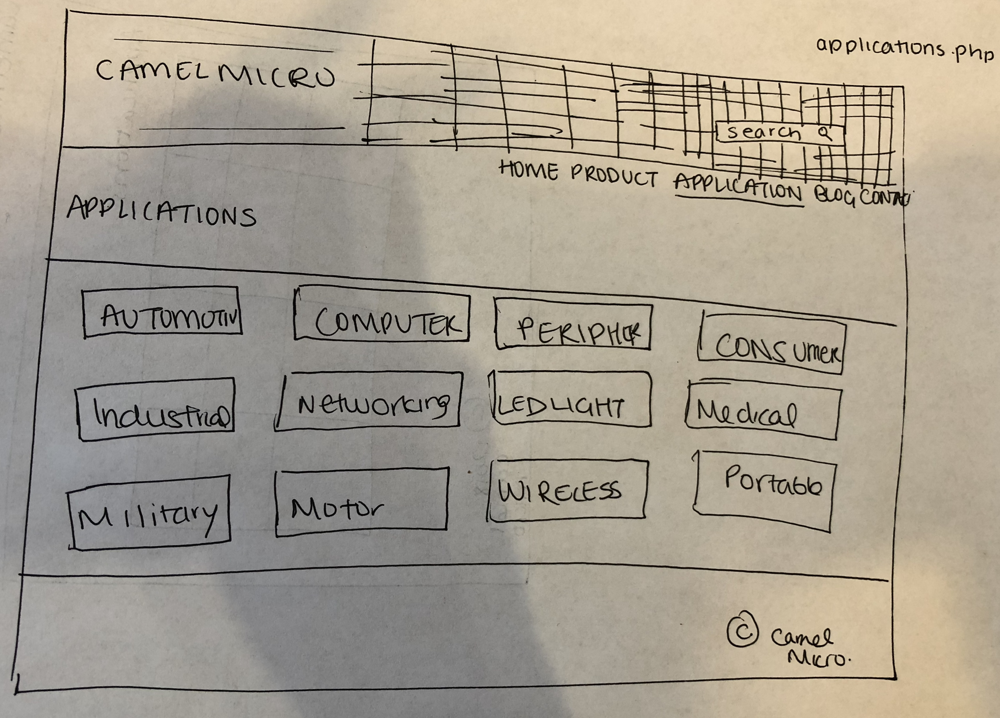
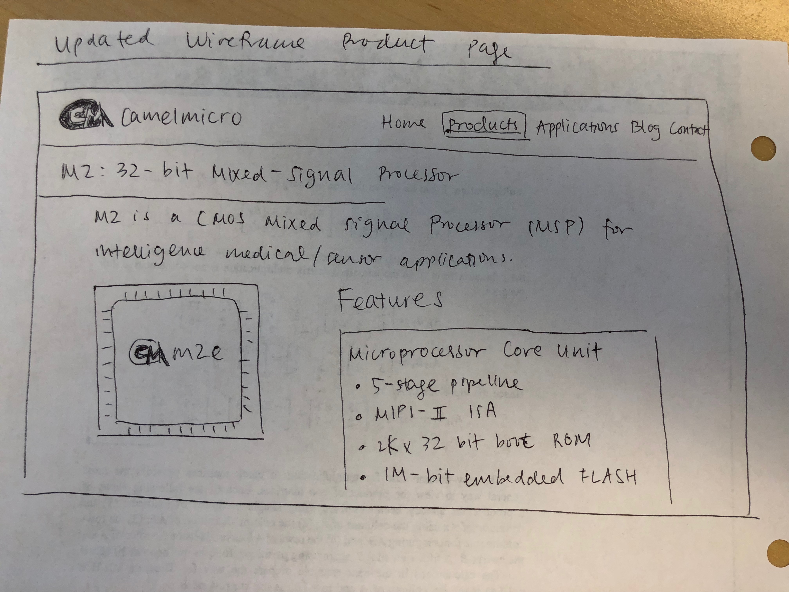
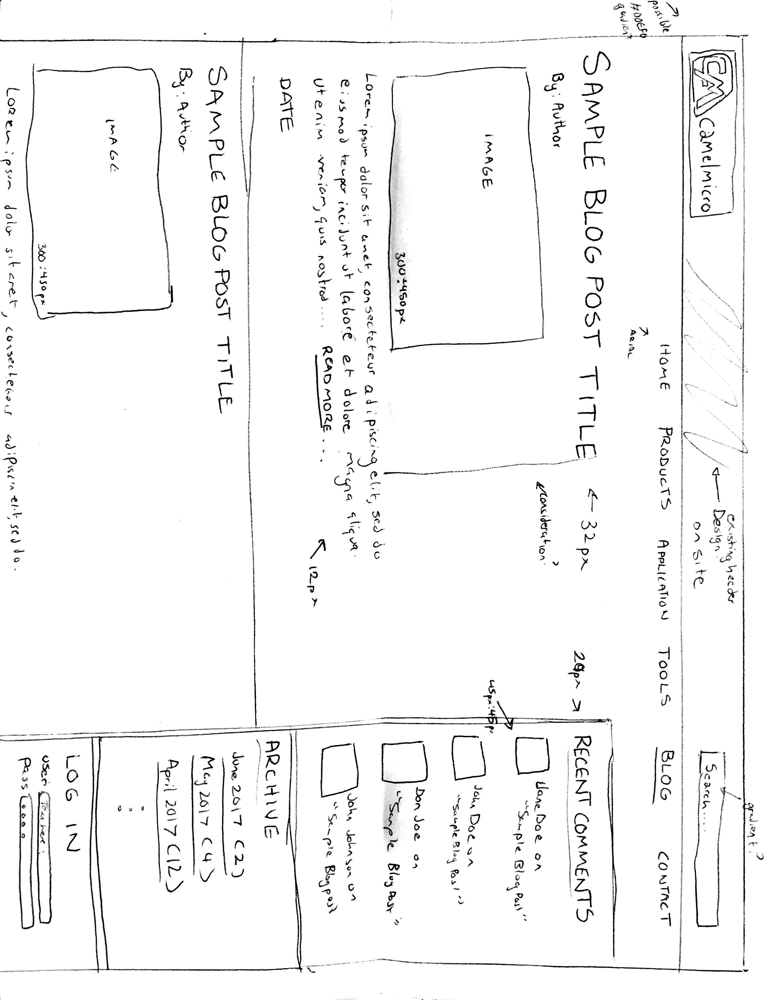
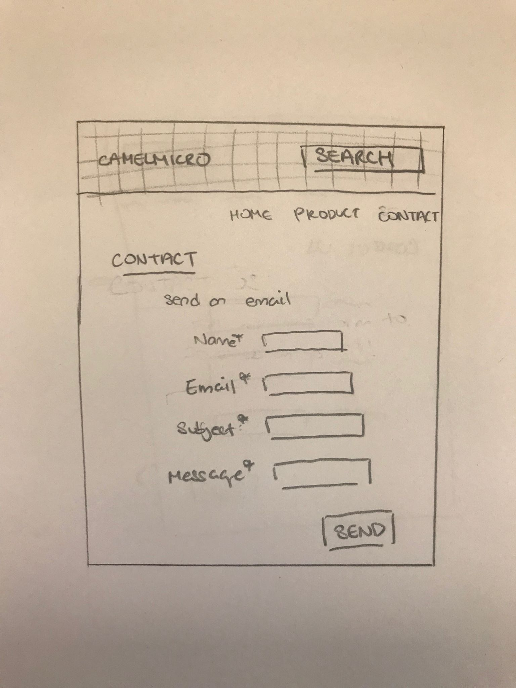

# Project 4 - Design & Plan

Your Team Name: Green Lion

## Milestone 1, Part II: Client Selection

### Client Description

Camel Micro:
Camel microelectronics is a fabless integrated circuit design company with focus on 32bit  MCU(micro-controller unit) products for medical, industrial automation, instrument, automotive, electronic and IoT (Internet of Things) devices.  Camel microelectronics is headquartered in Shanghai, China. Camel microelectronics also has R&D center in silicon valley, USA.  Camel microelectronics provides, world class performance, quality and cost, 32bit MCU solutions to medical appliance, advanced motor control, industrial automation, and IoT devices.

## Milestone 1, Part III: Client Requirements

### Target Audience(s)

The users are engineer and marketing person. The most place they interact with the website would be the blog section.


### Purpose & Content

The purpose of the website is to tell people who we are and what we do.

### Needs and Wants

This website tells our customer or potential customer who we are and what our products can do. It also serve as an information center that user can find technical documents to help them use our products, and exchange ideas with engineers of our company and other users.

* Needs/Wants
  * **Needs and Wants** (What does your client and audience need and want?)
    * Search bar for technical documents
    * Information center
    * Exchange ideas with engineers and other users
    * Chinese version of this website
  * **Design Ideas and Choices** (How will you meet those needs and wants?)
    * We will probably use a form for search
    * the blog post will allow for exchange of ideas with users
    * We will be using google translate to help make a Chinese version of the website. We will have a toggle button on the home page. If users pick Chinese Version we will link them to a new set of links on the navigation bar that leads to Chinese pages.

  * **Memo** (Justify your decisions; additional notes.)
    * We will be using a form for search as we did before.
    * The blog post is due to the request of the client and it also helps us implement the login and upload functions.
    * The Chinese toggle is at the request of the client and it using different a-href links in general rather than having an option to translate each page individually because it would be confusing for users to have to find the translate button on each page. In general, if they want one page translated, each page would be.

### Hosting Plan


[What is your plan for hosting your client's website?]

We will host the website on Heroku.

### Client's Edits

**Yes** they will edit the site, we will send them our files so they can edit the code and content themselves.

### Information Architecture, Content, and Navigation

Example:
* Content #1
  * **Main Navigation** (List your site's navigation here.)
    * Home
    * Products
    * Applications
    * Blogs
    * Contact
  * **Sub-Categories** (List any sub-categories of under the main navigation.)
    * N/A
  * **Content** (List all the content corresponding to main navigation and sub-categories.)
    * *Home*: Intro to company and company profile
    * *Products*: Description of their products which are computer chips
    * *Application*: Instruction for how to use your product
    * *Blogs*: Log in/ Log out to comment and add blog entries, list of all blog entries
    * *Contact*: Form for contact, other contact information

### Interactivity
* Log in and Log out to upload a blog and to comment.
* Commenting
* Send in contact form

Target audience wants to see reviews for products; log in and log out gives credibility to the source of the reviewers
Audience can use contact form to ask questions

### External Code

* Cookie
* Javascript

Cookies will only be used for 3-5% of the project. The rest will be our own code.

### Scale

6 pages, 10 hours per page.

## Milestone 1, Part IV: Work Distribution
1. April: Communicating with client for their wants and Needs (deadline: 4/17/2018)
2. Together draw wireframes (deadlines: 4/23/2018)
3. Work on includes together in person (deadline: 4/25/2018)
  * Header - Navigation bar + Toggle button
      * Search option in the header
  * Footer - Company Logo
  * Init - Pages information
4. We will each do a page of the website - just code and implementation; no design
  *  Iris
     * Home
        * Description of the website
        * Toggle button for translation
     * Contact Us
        * Form that automatically sends email out to company with information provided on the form
  *  April
    * Product
       * Description of the product with image display
  * PJ
    * Blog
      * Upload for files and comments
      * log in / log out function
  * Aaliya
    * Application
      * Image gallery with links to each application of the product the client wants.

    Internal deadline for these pages: 5/1/2018

4. Work on CSS together (deadlines: 5/5/2018)


## Milestone 1, Part V: Additional Comments

Subject to change due to client requests.


## Milestone 2, Part I: PHP Interactivity

[Describe here what you plan to do for your PHP Interactivity requirement.]

* Contact form

For the contact form, I plan have a database where I store the sender name, email, and message. If the information is correctly inputted into the database I will let them know their message has been recorded. The admins who log in will be able to see a table of these messages and respond accordingly. An alternative is also using the "mailto: " function.

* Blog Upload Form

For the blog upload form, I plan on using an upload, login/logoff, and submission form for both comments and blogs. This will require some iterations of foreach loops especially for the submission form (into an array of comments for a particular post), and the login/logoff system might be applied using the cookie system in Project 3 or the session_start() function built into PHP. As always, input and output will be filtered in order to accommodate certain submissions (ex. comments, blogs posts).

* Product Page

For the product page, I plan on having an image slideshow display for each product of the company. I will also have a interactive drop down menu of information separated by category of the product, which will require a for loop to populate the accordion. I plan on storing images of the product in the uploads folder. Since CamelMicro only has 1 product, I'll simply display the product and its text in PHP/HTML.

* Search

For the search bar on the header, We plan to limit it to just having search details for blog posts and products only in order to not violate any constraints with the database schema design. Using the same principles from project 3 (tag system) and project 2 (search bar), we plan to use SQL queries and foreach loops to execute the search navigation, which will require PHP interactivity to retrieve the SQL.

## Milestone 2, Part II: Sketches, Navigation & Wireframes

### Sketches








### Navigation

* Home
* Products
* Application
* Blog
  * Archive
  * Blog Posts
  * Recent comments
  * Login
* Contact

We will be implementing a top-level header/init approach in navigation as well as a search bar to navigate both posts and products.


### Wireframes








## Milestone 2, Part III: Evaluate your Design

[Use the GenderMag method to evaluate your wireframes.]

[Pick a persona that you believe will help you address the gender bias within your design.]

I've selected **Abby** as my persona.

I've selected my persona because the intricacies of Abby's motivations, attitudes, and her style of learning motivate me to reflect her needs into a fully functional webpage that reflects those desires. I want to engage on Abby's comprehensive information processing style and her aversive attitude to reformat the current CamelMicro Site. I want to engage and immerse her abilities and needs fully by using a model of a responsive, simple, and logic driven site about Camel Micros's products. I also want to reflect these styles and processes into a  page that employs the server side technologies already learned into a logic driven site that Abby is able to use seamlessly.

### Tasks

[You will need to evaluate at least 3 tasks (known as scenarios in the GenderMag literature). List your tasks here. These tasks are the same as the task you learned in INFO/CS 1300.]

[For each task, list the ideal set of actions that you would like your users to take when working towards the task.]

**Task 1: Navigating and learning more about  a certain application of CamelMicro products (ex. Military)**

  1. Go to the Application Page
  2. Scroll down to Applications
  3. Press on Military

**Task 2: Navigating to a specific blog post from September 2017**

1. Go to the Blog Page
2. Press on Archive (September 2017)
3. Scroll down for the blog post from all posts in September 2017

**Task 3: Navigating And submitting information to the contact form.**

1. Go to the Contact Page
2. Fill out required queries on form
3. Submit form

### Cognitive Walkthrough

[Perform a cognitive walkthrough using the GenderMag method for all of your Tasks. Use the GenderMag template in the <documents/gendermag-template.md> file.]

Below are the attached cognitive walkthroughs for each task at hand for the CamelMicro site.


#### Task 1 - Cognitive Walkthrough

**Task 1: Navigating and learning more about  a certain application of CamelMicro products (ex. Military)**

  1. Go to the Application Page

  **Action 1 : Click on Application Page**
  At this step, Abby is expected to know what to do at this step because the task at hand is simple enough for Abby to execute given her low computer self-efficacy score, and she is then able to gather information comprehensively to achieve the task at hand. She is also making progress towards her goal in finding Military because she now knows that she has hit the Application page.


  2. Scroll down to Applications

  **Action 2 : Scroll down to the Application at hand**
  At this step, we know that Abby tends to gather information comprehensively, meaning she tries to read a lot first before actually executing the task at hand. The way our wireframe is laid out allows this to be executed well, as the applications are listed down as Abby scrolls before she finds the one she wants. She also knows that she is making progress towards her goal because she is scrolling down all applications (thereby minimizing risk) and finding the Military Tab.

  3. Press on Military

  **Action 3 : Click on the Military Tab to know more**
  At this step, we know that Abby has high risk aversion, meaning she will not execute an action before she knows that she is certain the action she is doing will warrant the given result. At this stage of the action, she is now certain that clicking on the Military Tab will allow her to actively look into the Military applications of the Camel Micro products, successfully completing her goal.


#### Task 2 - Cognitive Walkthrough

**Task 2: Navigating to a specific blog post from September 2017**

1. Go to the Blog Page

**Action 1 : Click on Blog Page**
At this step, Abby is expected to know what to do at this step because the task at hand is simple enough for Abby to execute given her low computer self-efficacy score, and she is then able to gather information comprehensively to achieve the task at hand. She is also making progress towards her goal in finding the blog post from September 2017 because she now knows that she has hit the Blog page where she will be able to find the blog post from September 2017.


2. Press on Archive (September 2017)

**Action 2 : Scroll down to the Archive**
At this step, we know that Abby tends to gather information comprehensively, meaning she tries to read a lot first before actually executing the task at hand. The way our wireframe is laid out allows this to be executed well, as the applications are listed down as Abby scrolls before she finds the one she wants. She also knows that she is making progress towards her goal because she is scrolling down all months/years (thereby minimizing risk) and finding the September 2017 link.

**Action 3: Press on September 2017**
At this step, we know that Abby is certain, based on her high risk aversion, that she will be able to find a post that is from September 2017, given the signal from the title of the section (Archive) and the actual month.

3. Scroll down for the blog post from all posts in September 2017

**Action 4 : Scroll to find the post**
At this step, given Abby's comprehensive information style, we know that Abby will want to first scroll down through all blog posts before actually finding the one she wants. Therefore, we simplified our wireframe to accommodate this step so that she can now find the blog post at hand. This also minimizes her risk at hand because she will know which blog post from September 2017 is, successfully accomplishing her goal.


#### Task 3 - Cognitive Walkthrough

**Task 3: Navigating And submitting information to the contact form.**

1. Go to the Contact Page

**Action 1 : Click on Contact Page**
At this step, Abby should  know what to do because the task at hand is logic driven and simplistic for Abby to execute given her low computer self-efficacy score, and she is then able to gather information comprehensively to achieve the task at hand. She is also making progress towards her goal in finding the Contact page in order to submit her concerns to CamelMicro.


2. Fill out required queries on form

**Action 2 : Fill out each query on the form**
At this step, we know that Abby has high risk aversion and process oriented learning. This means that she wants to make sure that each step of the way, she is completing the right query and form before she submits anything. By emphasizing for the form a top-down approach before Abby ever hits submit, we ensure that Abby knows that she/he is required to fill out each query before moving on to the submission, also letting her know that she is reaching her goal.

3. Submit form

**Action 3 : Hit submit**
We know that Abby gathers information comprehensively and is aversive to risk, so in finally filling out each query (with filtered input and escaped output), we know that Abby has successfully minimized her risk in making an error with the form submission and has gathered all the information on the site sufficiently to execute the goal at hand, which in this case reflects submission of the form and query to CamelMicro.

### Cognitive Walk-though Results

[Did you discover any issues with your design? What were they? How did you change your design to address the gender-inclusiveness bugs you discovered?]

[Your responses here should be very thorough and thoughtful.]

As a result of modifications from previous wireframes and sketches from doing multiple cognitive walkthroughs with the three tasks, we were able to successfully accommodate for any gender-inclusiveness and ability related bugs or issues related to the design of the CamelMicro site. We know that the clientele base for CamelMicro is diverse, meaning that the GenderMag method is even more important to apply to make sure that usability of the site is seamless and can allow for all use cases to be successful, minimizing lost revenue for CamelMicro in the process.

By focusing on Abby, which we consider to be the base user clientele for CamelMicro as well as a good case for many users, we tackled the five problem-solving facets mattering to software gender-inclusiveness. We primarily focused on motivations for using the site, information processing style, computer self-efficacy, attitudes towards risk, and learning style, we were able to address the concerns of users potentially visiting the site with relation to how the site is organized.

We paid attention to the high risk aversion, low computer self-efficacy, and comprehensive information processing style of Abby in order to tackle the tasks at hand. We found that making sure that the site's navigation, both on the header and on actual sections for each page, must emphasize a logic driven and simplified approach in order to accommodate all base users and their related issues with using technology. We revised much of our wireframes after the first few cognitive walkthroughs in order to really emphasize the need to fit this simple approach.

As a result of deliberations and edits, we feel that we have finally minimized all gender and ability related bugs in using the site by relating to the Abby's persona. The navigation and access to certain details on the site, such as Blog Posts or Applications, have been simplified to fit this persona and minimize risk.

## Milestone 2, Part IV: Database Plan

### Database Schema

[Describe the structure of your database. You may use words or a picture. A bulleted list is probably the simplest way to do this.]

Table: accounts
* field 1: id NOT NULL PK AUTOINCREMENT
* field 2: username NOT NULL
* field 3: password NOT NULL

Table: blogs
* field 1: id NOT NULL PK AUTOINCREMENT
* field 2: username NOT NULL
* field 3: title NOT NULL
* field 4: text NOT NULL
* field 5: image

Table: contact
* field 1: id NOT NULL OK AUTOINCREMENT
* field 2: username NOT NULL
* field 3: email NOT NULL
* field 4: timestamp NOT NULL
* field 5: text NOT NULL

Table: applications
* field 1: id NOT NULL OK AUTOINCREMENT
* field 2: application NOT NULL
* field 3: diagram_name NOT NULL


### Database Queries

Blogs:
SELECT * FROM Blogs

Applications:

(queries for each form of application)
SELECT*FROM applications
SELECT * FROM applications WHERE application=='automotive'
SELECT * FROM applications WHERE application=='wireless'
SELECT * FROM applications WHERE application=='networking'
SELECT * FROM applications WHERE application=='military'
SELECT * FROM applications WHERE application=='computer'
SELECT diagram_img FROM applications WHERE diagram_name='Audio and Infotainment System'
SELECT diagram_img FROM applications WHERE diagram_name='Body Electronics'
SELECT diagram_img FROM applications WHERE diagram_name='braking'
SELECT diagram_img FROM applications WHERE diagram_name='door module'

## Milestone 2, Part V: Structure and Pseudocode

### Structure

[List the PHP files you will have. You will probably want to do this with a bulleted list.]

* index.php - main page.
* includes/init.php - stuff that useful for every web page.
* includes/header.php - the logo and navbar
* includes/footer.php - just an end note at the bottom of the web pages
* product.php - display of the product the company has
* application.php - display of applications for each product
* blog.php - reviews and messages displayed to the public; must be logged in to post
* contact.php - send a message to the company


### Pseudocode

[For each PHP file, plan out your pseudocode. You probably want a subheading for each file.]

#### includes/init.php

```
messages = array to store messages for user

// DB helper functions (you do not need to write this out since they are provided.)

db = connect to db

pages = associative array with php file to page title

...

```

#### includes/header.php

```
header - logo + design

navbar - for each page in pages show a-href links

```

#### index.php

```
Pseudocode for index.php...

include init.php

include header.php

Display description of website

```

#### contact.php

```
Pseudocode for contact.php

include init.php
include header.php

access database

$contact-messages = array();

Foreach $contact_message
display message

if ($_POST['send']){
  INSERT message, username, email INTO contact table
};

If no errors{
  array_push ($contact_message, 'Message sent')
}else {
  array_push($contact_message, 'Error in sending, please send again');
}


```

#### blog.php

```
Pseudocode for  blog.php...

include init.php

include header.php

SQL Query for fetching of all blog posts and Comments

New Blog post:
confirm user access controls for Author
Submission button (radio?)
Filter input of text, image
INSERT.... WHERE values (........)
foreach blog post{
  push post into array
  push comment into array
}
... => ....:


Delete Blog post:
- confirm user access controls
- unlink blog post and comments from folder
- DELETE FROM.... WHERE.....

Recent Comments:
FETCH ALL.... WHERE comments ON post

Archive:
SQL execute (FETCH ALL .... WHERE dates)

Login/Logout:
session_start()?
could use possibly cookie system, although most will be defined in init.php to simplify

```


#### product.php
```
Pseudocode for product.php

include init.php
include header.php

Display title of the solo product
Display overview description text of product above the slideshow image
Display solo product image floated left
Display list of features of product on right as text
```

#### applications.php
```
Pseudocode for product.php

include init.php
include header.php
Display applications table
include footer.php
```

## Milestone 2, Part VI: Additional Comments

Subject to change due to client requests, but we will be contacting them shortly this week (4/23) to confirm details.

The team contract has also remained the same since Milestone 1.


## Milestone 3: Updates

The draft for this milestone focuses on the actually theme of the site as well as other implementation features such as blog.php, product.php, and application.php in order to really reflect the designs needed by the CamelMicro team

For contact.php instead of using a database to display the messages we decided to use the built in mail() function of php to send the email out. We also took out the search function for now because there is not enough seed data to warrant a search, and we need to deliberate with the CamelMicro team in assessing if they want to search function for blog posts, applications, or miscellaneous.

Additionally, we are setting up a video call with Bill Xie, our main point of contact for CamelMicro, in order to deliberate over future features on the site as well as the site design sometime Wednesday (05/02/2018) around 4 PM. We want to be able to implement the features our client wants first before we move ahead with the proposed frameworks in blog.php, application.php, and product.php.


## Milestone 4: Updates

[If you make any changes to your plan or design based on your peers' feedback, make a list of the changes here.]

We made design changes according to peers' feedback:

1. The header was changed to be more minimalistic and aesthetic, instead of the original pink/multicolor hashed image background. Now, the header is a minimalistic white with color-coordinated tab color/hover colors.

2. Overall design of the website is unified with font size and font family, and margins are made uniform as well. This is an update from the original different combination of fonts, margin sizes, and font sizes across the site.

## Milestone 5: Cognitive Walkthrough

[Copy your tasks here from Milestone 2. Update them if you need to and then conduct another cognitive walkthrough.]

Task 1: Navigating and learning more about a certain application of CamelMicro products (ex. Military)

1. Go to the Application Page
2. Scroll down to see all the different application options
3. Press on option "Automotive"

Task 2: Navigating to a specific blog post from September 2017

1. Go to the Blog Page
2. Press on Archive (September 2017)
3. Scroll down for the blog post from all posts in September 2017

Task 3: Navigating And submitting information to the contact form.

1. Go to the Contact Page
2. Fill out required queries on form
3. Submit form

### Cognitive Walk-though Results

[Did you discover any issues with your design? What were they? How did you change your design to address the gender-inclusiveness bugs you discovered?]

[Your responses here should be very thorough and thoughtful.]
#### Task 1 - Cognitive Walkthrough

**Task 1: Navigating and learning more about CamelMicro products**

  1. Go to the Application Page

  **Action 1 : Click on Application Page**
  At this step, Abby is expected to know what to do at this step because the task at hand is simple enough for Abby to execute given her low computer self-efficacy score, and she is then able to gather information comprehensively to achieve the task at hand. She is also making progress towards her goal in finding out different application options for CamelMicro's product because she now knows that she has hit the Application page.


  2. Scroll down to Applications

  **Action 2 : Scroll down to see the different Application options**
  At this step, we know that Abby tends to gather information comprehensively, meaning she tries to read a lot first before actually executing the task at hand. The way our wireframe is laid out allows this to be executed well, as the applications are listed in a simple, straight-forward table view as Abby scrolls before she finds the one she wants. She also knows that she is making progress towards her goal because she is scrolling down all possible applications (thereby minimizing risk) before choosing an application (which will change color when mouse is hovered over) via clicking.

  3. Press on Automotive

  **Action 3 : Click on the Automotive option to know more**
  At this step, we know that Abby has high risk aversion, meaning she will not execute an action before she knows that she is certain the action she is doing will warrant the given result. At this stage of the action, she is now certain that clicking on the Automotive option will allow her to actively look into the Automotive applications of the CamelMicro product, successfully completing her goal.


#### Task 2 - Cognitive Walkthrough

**Task 2: Navigating to a specific blog post from September 2017**

1. Go to the Blog Page

**Action 1 : Click on Blog Page**
At this step, Abby is expected to know what to do at this step because the task at hand is simple enough for Abby to execute given her low computer self-efficacy score, and she is then able to gather information comprehensively to achieve the task at hand. She is also making progress towards her goal in finding the blog post from September 2017 because she now knows that she has hit the Blog page where she will be able to find the blog post from September 2017.


2. Press on Archive (September 2017)

**Action 2 : Scroll down to the Archive**
At this step, we know that Abby tends to gather information comprehensively, meaning she tries to read a lot first before actually executing the task at hand. The way our wireframe is laid out allows this to be executed well, as the applications are listed down as Abby scrolls before she finds the one she wants. She also knows that she is making progress towards her goal because she is scrolling down all months/years (thereby minimizing risk) and finding the September 2017 link.

**Action 3: Press on September 2017**
At this step, we know that Abby is certain, based on her high risk aversion, that she will be able to find a post that is from September 2017, given the signal from the title of the section (Archive) and the actual month.

3. Scroll down for the blog post from all posts in September 2017

**Action 4 : Scroll to find the post**
At this step, given Abby's comprehensive information style, we know that Abby will want to first scroll down through all blog posts before actually finding the one she wants. Therefore, we simplified our wireframe to accommodate this step so that she can now find the blog post at hand. This also minimizes her risk at hand because she will know which blog post from September 2017 is, successfully accomplishing her goal.

**Task 3: Navigating And submitting information to the contact form.**

1. Go to the Contact Page

**Action 1 : Click on Contact Page**
At this step, Abby should  know what to do because the task at hand is logic driven and simplistic for Abby to execute given her low computer self-efficacy score, and she is then able to gather information comprehensively to achieve the task at hand. She is also making progress towards her goal in finding the Contact page in order to submit her concerns to CamelMicro.


2. Fill out required queries on form

**Action 2 : Fill out each query on the form**
At this step, we know that Abby has high risk aversion and process oriented learning. This means that she wants to make sure that each step of the way, she is completing the right query and form before she submits anything. By emphasizing for the form a top-down approach before Abby ever hits submit, we ensure that Abby knows that she/he is required to fill out each query before moving on to the submission, also letting her know that she is reaching her goal.

3. Submit form

**Action 3 : Hit submit**
We know that Abby gathers information comprehensively and is aversive to risk, so in finally filling out each query (with filtered input and escaped output), we know that Abby has successfully minimized her risk in making an error with the form submission and has gathered all the information on the site sufficiently to execute the goal at hand, which in this case reflects submission of the form and query to CamelMicro.


## Milestone 5: Final Notes to the Clients

[Describe in some detail what the client will do (or would have to do) in order to make this website go live. What is the deployment plan?]

For this course, we will be deploying via Heroku, but since Heroku does not save the data for more than 24 hours, CamelMicro will need a different deploying platform to make the website truly functional. CamelMicro plans to deploy it themselves to their domain name camelmicro.com.

[Include any other information that your client needs to know about your final website design. For example, what client wants or needs were unable to be realized in your final product? Why were you unable to meet those wants/needs?]

We don't have a search bar because we felt that it was not necessary design wise for the current plan, especially for our project persona Abby (for the most straight forward navigation for the website). CamelMicro also did not end up wanting a translation to Chinese version of the website, so that portion was not implemented.

## Milestone 5: Final Notes to the Graders

[1. Give us three specific strengths of your site that sets it apart from the previous website of the client (if applicable) and/or from other websites. Think of this as your chance to argue for the things you did really well.]

1. Our navigation of the site is a lot cleaner and straight forward (including the color palette, color differentiation of different actionable components, navigation bar, aesthetics, etc.)

2. A lot of their links pointed to external sites or files, so our site consolidates everything very cleanly into one website that has easy navigation logic.

3. We have a log in/log out function on our new site, so we can help CamelMicro differentiate between viewers and customers/registered users.

[2. Tell us about things that don't work, what you wanted to implement, or what you would do if you keep working with the client in the future. Give justifications.]

If we kept working with the client in the future, we would have tried to see if there was more content or more reason to have a search bar. The main reason why we did not implement a search bar this time was because CamelMicro gave us free reigns to implement/take out whichever components of the website, and we as a team felt that the search bar was not necessary, since there was nothing to "search". CamelMicro has only 1 product, and it is clearly displayed under the products tab. So, in the future, if they ever come up with more products, we would love to display that product on the site and incorporate a search bar if necessary.

[3. Tell us anything else you need us to know for when we're looking at the project.]

We also created our website so that for the Application page, each cell can only be clicked on to be taken to the next page by clicking the words, not the entire cell. We thought it would be clear for users that they know where their mouse is hovering at by changing color of the table cell from gray to orange when the cell was hovered over, but only when the users hover of the words in the cell will the words become underlined, and the user will be able to click through to the next page. We believe that designing our site this way would be the most straightforward for our users, since links/hyperlinks are usually correlated to taking pages to a new site, and hyperlinks/links are emphasized with an underline on the linked text. Thus, that is the method we chose to follow.
